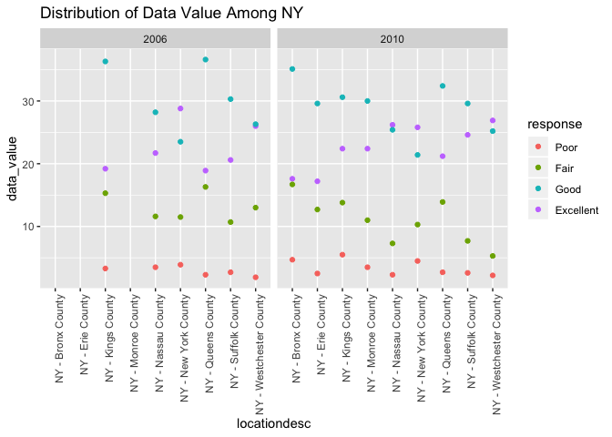
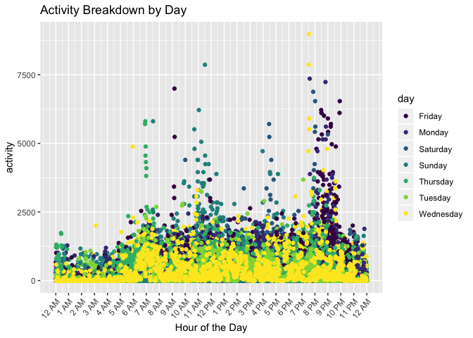

HW3
================
Sarah Munro
10/13/2019

``` r
library(tidyverse)
```

\#Problem 1

*Load the dataset instacart*

``` r
library(p8105.datasets)
data("instacart")
```

``` r
view(instacart)
```

*Describe the dataset instacart* The dataset `instacart` has 1384617
observations and 15 variables. The dataset contains information on
products ordered from a grocery store with key variables including
`order_id` `aisle` `product_name` and `department`. The variables
provide a very detailed breakdown of the orders describing the order in
which products were added as well as the hour of the day the order was
placed.

*Count the number of aisles and the aisles with the most items orderd*

``` r
count(instacart, aisle, name = "n_orders") %>%
arrange(desc(n_orders)) 
```

    ## # A tibble: 134 x 2
    ##    aisle                         n_orders
    ##    <chr>                            <int>
    ##  1 fresh vegetables                150609
    ##  2 fresh fruits                    150473
    ##  3 packaged vegetables fruits       78493
    ##  4 yogurt                           55240
    ##  5 packaged cheese                  41699
    ##  6 water seltzer sparkling water    36617
    ##  7 milk                             32644
    ##  8 chips pretzels                   31269
    ##  9 soy lactosefree                  26240
    ## 10 bread                            23635
    ## # … with 124 more rows

``` r
##There are 134 asiles in total. The aisles for fresh vegetables and fresh fruits received the most orders, with 150,609 items and 150,473 items ordered respectively.  
```

*Make a plot that shows the number of items ordered in each aisle,
limiting this to aisles with more than 10000 items ordered*

``` r
instacart %>%
  count(aisle, name = "n_orders") %>%
  filter (n_orders > 10000) %>%
  ggplot(aes(x=aisle, y=n_orders)) + 
  geom_point(color = "magenta") + 
  theme(
    axis.text.x = element_text(angle=90, hjust=1)
  ) +
  labs(title = "Quantity of Items Ordered by Aisle", x = "Aisle Name", y = "Number of Items Ordered") 
```

<!-- -->

*Create a table showing the three most popular items in each of the
aisles “baking ingredients”, “dog food care”, and “packaged vegetables
fruits”*

``` r
instacart %>%
  filter(aisle == "baking ingredients" | aisle == "dog food care" | aisle == "packaged vegetables fruits") %>%
  group_by(aisle, product_name) %>%
  summarize(order_frequency = n()) %>%
  top_n(3) %>%
  arrange(desc(order_frequency)) %>%
  knitr::kable ()
```

    ## Selecting by order_frequency

| aisle                      | product\_name                                 | order\_frequency |
| :------------------------- | :-------------------------------------------- | ---------------: |
| packaged vegetables fruits | Organic Baby Spinach                          |             9784 |
| packaged vegetables fruits | Organic Raspberries                           |             5546 |
| packaged vegetables fruits | Organic Blueberries                           |             4966 |
| baking ingredients         | Light Brown Sugar                             |              499 |
| baking ingredients         | Pure Baking Soda                              |              387 |
| baking ingredients         | Cane Sugar                                    |              336 |
| dog food care              | Snack Sticks Chicken & Rice Recipe Dog Treats |               30 |
| dog food care              | Organix Chicken & Brown Rice Recipe           |               28 |
| dog food care              | Small Dog Biscuits                            |               26 |

*Make a table showing the mean hour of the day at which Pink Lady Apples
and Coffee Ice Cream are ordered on each day of the week*

``` r
instacart %>%
  filter( product_name == "Pink Lady Apples" | product_name == "Coffee Ice Cream") %>%
  group_by(product_name, order_dow) %>%
  summarize(avg_hour = mean(order_hour_of_day)) %>%
  select(product_name, order_dow, avg_hour) %>%
  pivot_wider(
    names_from = order_dow,
    values_from = avg_hour) %>%
knitr::kable ()
```

| product\_name    |        0 |        1 |        2 |        3 |        4 |        5 |        6 |
| :--------------- | -------: | -------: | -------: | -------: | -------: | -------: | -------: |
| Coffee Ice Cream | 13.77419 | 14.31579 | 15.38095 | 15.31818 | 15.21739 | 12.26316 | 13.83333 |
| Pink Lady Apples | 13.44118 | 11.36000 | 11.70213 | 14.25000 | 11.55172 | 12.78431 | 11.93750 |

\#Problem 2

*Clean the dataset BRFSS*

``` r
data("brfss_smart2010")
brfss = brfss_smart2010 %>%
  janitor::clean_names() %>% 
  filter(topic == "Overall Health", response == "Excellent" | response == "Very Good" | response == "Good" | response == "Fair" | response == "Poor") %>%
mutate(response = factor(response, levels =  c("Poor","Fair","Good","Very Good","Excellent")))
  brfss
```

    ## # A tibble: 8,500 x 23
    ##     year locationabbr locationdesc class topic question response
    ##    <int> <chr>        <chr>        <chr> <chr> <chr>    <fct>   
    ##  1  2010 AL           AL - Jeffer… Heal… Over… How is … Excelle…
    ##  2  2010 AL           AL - Jeffer… Heal… Over… How is … Good    
    ##  3  2010 AL           AL - Jeffer… Heal… Over… How is … Fair    
    ##  4  2010 AL           AL - Jeffer… Heal… Over… How is … Poor    
    ##  5  2010 AL           AL - Mobile… Heal… Over… How is … Excelle…
    ##  6  2010 AL           AL - Mobile… Heal… Over… How is … Good    
    ##  7  2010 AL           AL - Mobile… Heal… Over… How is … Fair    
    ##  8  2010 AL           AL - Mobile… Heal… Over… How is … Poor    
    ##  9  2010 AL           AL - Tuscal… Heal… Over… How is … Excelle…
    ## 10  2010 AL           AL - Tuscal… Heal… Over… How is … Good    
    ## # … with 8,490 more rows, and 16 more variables: sample_size <int>,
    ## #   data_value <dbl>, confidence_limit_low <dbl>,
    ## #   confidence_limit_high <dbl>, display_order <int>,
    ## #   data_value_unit <chr>, data_value_type <chr>,
    ## #   data_value_footnote_symbol <chr>, data_value_footnote <chr>,
    ## #   data_source <chr>, class_id <chr>, topic_id <chr>, location_id <chr>,
    ## #   question_id <chr>, respid <chr>, geo_location <chr>

*In 2002, which states were observed at 7 or more locations? What about
in 2010?*

``` r
brfss %>%
  filter(year == 2002 ) %>%
  group_by(locationabbr) %>%
  summarize(n_locations = n_distinct(geo_location)) %>%
  select(locationabbr, n_locations) %>%
  arrange(desc(n_locations))
```

    ## # A tibble: 49 x 2
    ##    locationabbr n_locations
    ##    <chr>              <int>
    ##  1 PA                    10
    ##  2 MA                     8
    ##  3 NJ                     8
    ##  4 CT                     7
    ##  5 FL                     7
    ##  6 NC                     7
    ##  7 MD                     6
    ##  8 NH                     5
    ##  9 NY                     5
    ## 10 UT                     5
    ## # … with 39 more rows

``` r
## There are 6 states (PA, MA, NJ, CT, FL, NC) that were observed at 7 or more locations in 2002
```

``` r
brfss %>%
  filter(year == 2010 ) %>%
  group_by(locationabbr) %>%
  summarize(n_locations = n_distinct(geo_location)) %>%
  select(locationabbr, n_locations) %>%
  arrange(desc(n_locations))
```

    ## # A tibble: 49 x 2
    ##    locationabbr n_locations
    ##    <chr>              <int>
    ##  1 FL                    41
    ##  2 NJ                    19
    ##  3 TX                    16
    ##  4 CA                    12
    ##  5 MD                    12
    ##  6 NC                    12
    ##  7 NE                    10
    ##  8 WA                    10
    ##  9 MA                     9
    ## 10 NY                     9
    ## # … with 39 more rows

``` r
## In 2010 there were 14 states observed at 7 or more locations
```

*Make a new dataset and a spaghetti plot showing the average data values
over time for each state*

``` r
excellent_health = brfss %>%
  filter(response == "Excellent") %>%
  group_by(year, locationabbr) %>%
  summarize(avg = mean(data_value)) %>%
  select (year, locationabbr, avg) %>%
ggplot(aes(x=year, y=avg)) +geom_line(aes(color=locationabbr)) + labs(title = "Average State Data Values Across Time", y = "Average Data Values")
excellent_health
```

    ## Warning: Removed 3 rows containing missing values (geom_path).

<!-- -->

*Make a two-panel plot showing distribution of data\_value for responses
among locations in NY State*

``` r
brfss %>%
  filter (locationabbr == "NY", year == 2006 | year == 2010) %>%
  ggplot(aes(x=locationdesc, y=data_value)) + geom_point(aes(color=response)) + facet_grid(. ~year) + theme(
    axis.text.x = element_text(angle=90, hjust=1)) +
  labs(title = "Distribution of Data Value Among NY")
```

<!-- -->

\#Problem 3

*Load and tidy the new dataset*

``` r
acceleration = read_csv("./Data/accel_data.csv") %>%
  janitor::clean_names() %>%
  drop_na()%>%
  mutate(time_of_week = if_else(day == "Saturday" | day == "Sunday", "weekend", "week_day")) %>%
select(week, day_id, day, time_of_week, everything())
```

    ## Parsed with column specification:
    ## cols(
    ##   .default = col_double(),
    ##   day = col_character()
    ## )

    ## See spec(...) for full column specifications.

``` r
acceleration
```

    ## # A tibble: 35 x 1,444
    ##     week day_id day   time_of_week activity_1 activity_2 activity_3
    ##    <dbl>  <dbl> <chr> <chr>             <dbl>      <dbl>      <dbl>
    ##  1     1      1 Frid… week_day           88.4       82.2       64.4
    ##  2     1      2 Mond… week_day            1          1          1  
    ##  3     1      3 Satu… weekend             1          1          1  
    ##  4     1      4 Sund… weekend             1          1          1  
    ##  5     1      5 Thur… week_day           47.4       48.8       46.9
    ##  6     1      6 Tues… week_day           64.8       59.5       73.7
    ##  7     1      7 Wedn… week_day           71.1      103.        68.5
    ##  8     2      8 Frid… week_day          675        542       1010  
    ##  9     2      9 Mond… week_day          291        335        393  
    ## 10     2     10 Satu… weekend            64         11          1  
    ## # … with 25 more rows, and 1,437 more variables: activity_4 <dbl>,
    ## #   activity_5 <dbl>, activity_6 <dbl>, activity_7 <dbl>,
    ## #   activity_8 <dbl>, activity_9 <dbl>, activity_10 <dbl>,
    ## #   activity_11 <dbl>, activity_12 <dbl>, activity_13 <dbl>,
    ## #   activity_14 <dbl>, activity_15 <dbl>, activity_16 <dbl>,
    ## #   activity_17 <dbl>, activity_18 <dbl>, activity_19 <dbl>,
    ## #   activity_20 <dbl>, activity_21 <dbl>, activity_22 <dbl>,
    ## #   activity_23 <dbl>, activity_24 <dbl>, activity_25 <dbl>,
    ## #   activity_26 <dbl>, activity_27 <dbl>, activity_28 <dbl>,
    ## #   activity_29 <dbl>, activity_30 <dbl>, activity_31 <dbl>,
    ## #   activity_32 <dbl>, activity_33 <dbl>, activity_34 <dbl>,
    ## #   activity_35 <dbl>, activity_36 <dbl>, activity_37 <dbl>,
    ## #   activity_38 <dbl>, activity_39 <dbl>, activity_40 <dbl>,
    ## #   activity_41 <dbl>, activity_42 <dbl>, activity_43 <dbl>,
    ## #   activity_44 <dbl>, activity_45 <dbl>, activity_46 <dbl>,
    ## #   activity_47 <dbl>, activity_48 <dbl>, activity_49 <dbl>,
    ## #   activity_50 <dbl>, activity_51 <dbl>, activity_52 <dbl>,
    ## #   activity_53 <dbl>, activity_54 <dbl>, activity_55 <dbl>,
    ## #   activity_56 <dbl>, activity_57 <dbl>, activity_58 <dbl>,
    ## #   activity_59 <dbl>, activity_60 <dbl>, activity_61 <dbl>,
    ## #   activity_62 <dbl>, activity_63 <dbl>, activity_64 <dbl>,
    ## #   activity_65 <dbl>, activity_66 <dbl>, activity_67 <dbl>,
    ## #   activity_68 <dbl>, activity_69 <dbl>, activity_70 <dbl>,
    ## #   activity_71 <dbl>, activity_72 <dbl>, activity_73 <dbl>,
    ## #   activity_74 <dbl>, activity_75 <dbl>, activity_76 <dbl>,
    ## #   activity_77 <dbl>, activity_78 <dbl>, activity_79 <dbl>,
    ## #   activity_80 <dbl>, activity_81 <dbl>, activity_82 <dbl>,
    ## #   activity_83 <dbl>, activity_84 <dbl>, activity_85 <dbl>,
    ## #   activity_86 <dbl>, activity_87 <dbl>, activity_88 <dbl>,
    ## #   activity_89 <dbl>, activity_90 <dbl>, activity_91 <dbl>,
    ## #   activity_92 <dbl>, activity_93 <dbl>, activity_94 <dbl>,
    ## #   activity_95 <dbl>, activity_96 <dbl>, activity_97 <dbl>,
    ## #   activity_98 <dbl>, activity_99 <dbl>, activity_100 <dbl>,
    ## #   activity_101 <dbl>, activity_102 <dbl>, activity_103 <dbl>, …

The dataset `acceleration` has 35 observations and 1444 variables. Key
variables include `week` `day_id` and `time_of_week`. The activity
variables correspond to the average activity for each minute of the day.

*Aggregate accross minutes to create a total activity variable for each
day, and create a table showing these totals*

``` r
total_acc = acceleration %>%
    pivot_longer(activity_1:activity_1440,
    names_to = "daily_activity",
    values_to = "activity"
    ) %>%
    group_by(week, day_id, day, time_of_week) %>%
    summarize(total_activity = sum(activity)) 
total_acc
```

    ## # A tibble: 35 x 5
    ## # Groups:   week, day_id, day [35]
    ##     week day_id day       time_of_week total_activity
    ##    <dbl>  <dbl> <chr>     <chr>                 <dbl>
    ##  1     1      1 Friday    week_day            480543.
    ##  2     1      2 Monday    week_day             78828.
    ##  3     1      3 Saturday  weekend             376254 
    ##  4     1      4 Sunday    weekend             631105 
    ##  5     1      5 Thursday  week_day            355924.
    ##  6     1      6 Tuesday   week_day            307094.
    ##  7     1      7 Wednesday week_day            340115.
    ##  8     2      8 Friday    week_day            568839 
    ##  9     2      9 Monday    week_day            295431 
    ## 10     2     10 Saturday  weekend             607175 
    ## # … with 25 more rows

*There appears to be no noticeable trends, he is not consistently more
or less active on weekdays or weekends. It seems that he took his wrist
band off on the 24th and 31st day of the month, which are both
saturdays.*

``` r
total_acc %>%
  ggplot(aes(x=day_id, y=total_activity)) + geom_line(aes(color=day)) + labs(title= "Activity Breakdown by Day")
```

<!-- -->
*Monday has both one of the highest and lowest peaks. Saturday bottoms
out and plateaus at the end of the month when he takes his wrist band
off. Tuesday and Wednesday appear to be the most consistent days
throughout the month.*
