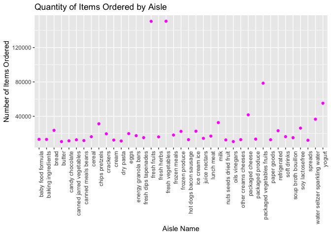

HW3
================
Sarah Munro
10/13/2019

``` r
library(tidyverse)
```

    ## ── Attaching packages ─────────────────────────── tidyverse 1.2.1 ──

    ## ✔ ggplot2 3.2.1     ✔ purrr   0.3.2
    ## ✔ tibble  2.1.3     ✔ dplyr   0.8.3
    ## ✔ tidyr   1.0.0     ✔ stringr 1.4.0
    ## ✔ readr   1.3.1     ✔ forcats 0.4.0

    ## ── Conflicts ────────────────────────────── tidyverse_conflicts() ──
    ## ✖ dplyr::filter() masks stats::filter()
    ## ✖ dplyr::lag()    masks stats::lag()

\#Problem 1

*Load the dataset instacart*

``` r
library(p8105.datasets)
data("instacart")
```

``` r
view(instacart)
```

*Describe the dataset instacart* The dataset `instacart` has 1384617
observations and 15 variables. The dataset contains information on
products ordered from a grocery store with key variables including
`order_id` `aisle` `product_name` and `department`. The variables
provide a very detailed breakdown of the orders describing the order in
which products were added as well as the hour of the day the order was
placed.

*Count the number of aisles and the aisles with the most items orderd*

``` r
count(instacart, aisle, name = "n_orders") %>%
arrange(desc(n_orders)) 
```

    ## # A tibble: 134 x 2
    ##    aisle                         n_orders
    ##    <chr>                            <int>
    ##  1 fresh vegetables                150609
    ##  2 fresh fruits                    150473
    ##  3 packaged vegetables fruits       78493
    ##  4 yogurt                           55240
    ##  5 packaged cheese                  41699
    ##  6 water seltzer sparkling water    36617
    ##  7 milk                             32644
    ##  8 chips pretzels                   31269
    ##  9 soy lactosefree                  26240
    ## 10 bread                            23635
    ## # … with 124 more rows

``` r
##There are 134 asiles in total. The aisles for fresh vegetables and fresh fruits received the most orders, with 150,609 items and 150,473 items ordered respectively.  
```

*Make a plot that shows the number of items ordered in each aisle,
limiting this to aisles with more than 10000 items ordered*

``` r
instacart %>%
  count(aisle, name = "n_orders") %>%
  filter (n_orders > 10000) %>%
  ggplot(aes(x=aisle, y=n_orders)) + 
  geom_point(color = "magenta") + 
  theme(
    axis.text.x = element_text(angle=90, hjust=1)
  ) +
  labs(title = "Quantity of Items Ordered by Aisle", x = "Aisle Name", y = "Number of Items Ordered") 
```

<!-- -->

*Create a table showing the three most popular items in each of the
aisles “baking ingredients”, “dog food care”, and “packaged vegetables
fruits”*

``` r
instacart %>%
  filter(aisle == "baking ingredients" | aisle == "dog food care" | aisle == "packaged vegetables fruits") %>%
  group_by(aisle, product_name) %>%
  summarize(order_frequency = n()) %>%
  top_n(3) %>%
  arrange(desc(order_frequency)) %>%
  knitr::kable ()
```

    ## Selecting by order_frequency

| aisle                      | product\_name                                 | order\_frequency |
| :------------------------- | :-------------------------------------------- | ---------------: |
| packaged vegetables fruits | Organic Baby Spinach                          |             9784 |
| packaged vegetables fruits | Organic Raspberries                           |             5546 |
| packaged vegetables fruits | Organic Blueberries                           |             4966 |
| baking ingredients         | Light Brown Sugar                             |              499 |
| baking ingredients         | Pure Baking Soda                              |              387 |
| baking ingredients         | Cane Sugar                                    |              336 |
| dog food care              | Snack Sticks Chicken & Rice Recipe Dog Treats |               30 |
| dog food care              | Organix Chicken & Brown Rice Recipe           |               28 |
| dog food care              | Small Dog Biscuits                            |               26 |

*Make a table showing the mean hour of the day at which Pink Lady Apples
and Coffee Ice Cream are ordered on each day of the week*

``` r
instacart %>%
  filter( product_name == "Pink Lady Apples" | product_name == "Coffee Ice Cream") %>%
  group_by(product_name, order_dow) %>%
  summarize(avg_hour = mean(order_hour_of_day)) %>%
  select(product_name, order_dow, avg_hour) %>%
  pivot_wider(
    names_from = order_dow,
    values_from = avg_hour) %>%
knitr::kable ()
```

| product\_name    |        0 |        1 |        2 |        3 |        4 |        5 |        6 |
| :--------------- | -------: | -------: | -------: | -------: | -------: | -------: | -------: |
| Coffee Ice Cream | 13.77419 | 14.31579 | 15.38095 | 15.31818 | 15.21739 | 12.26316 | 13.83333 |
| Pink Lady Apples | 13.44118 | 11.36000 | 11.70213 | 14.25000 | 11.55172 | 12.78431 | 11.93750 |
